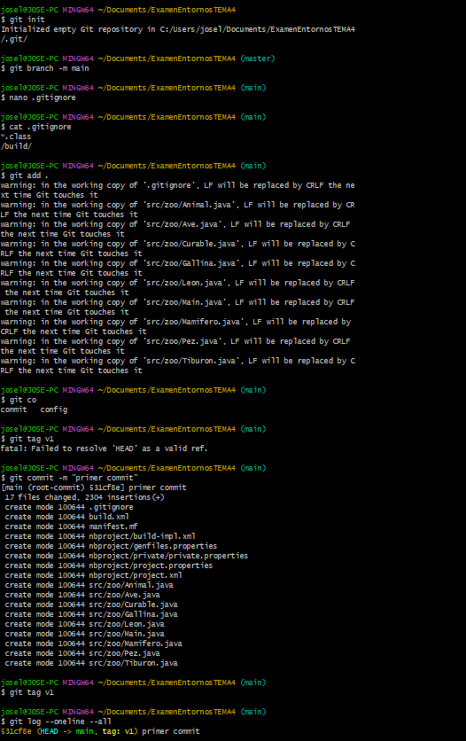
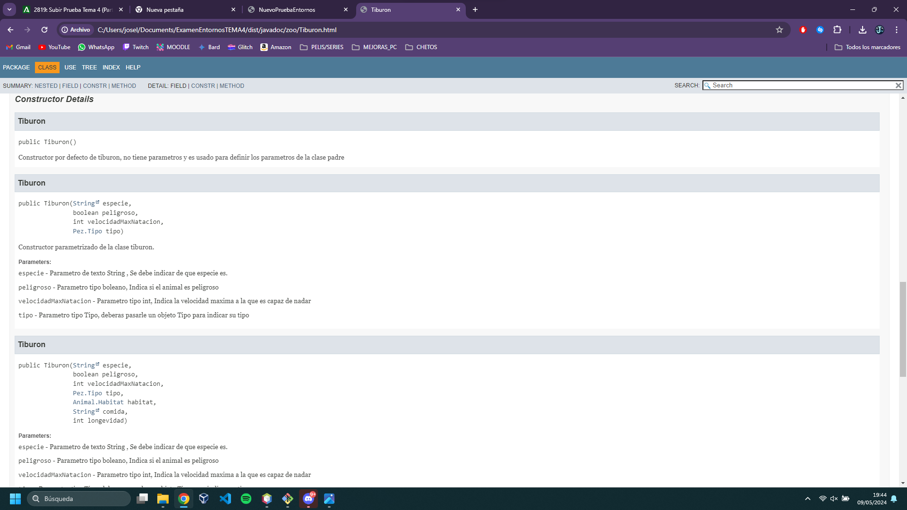
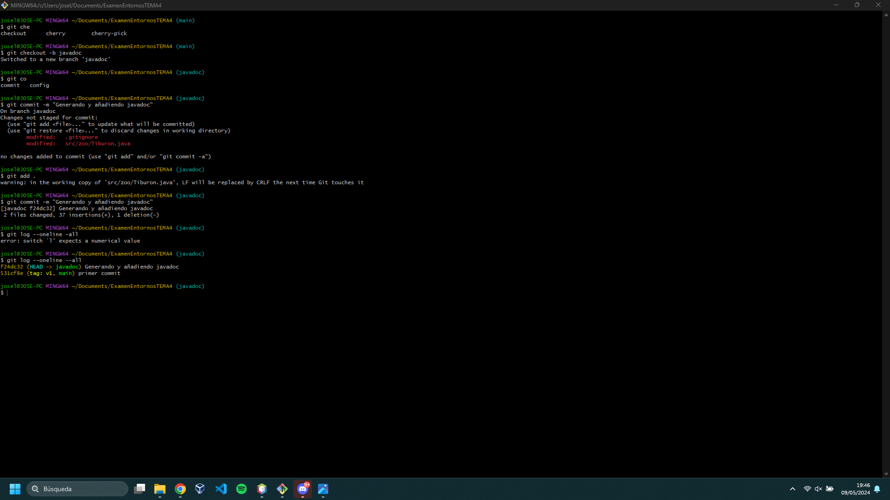
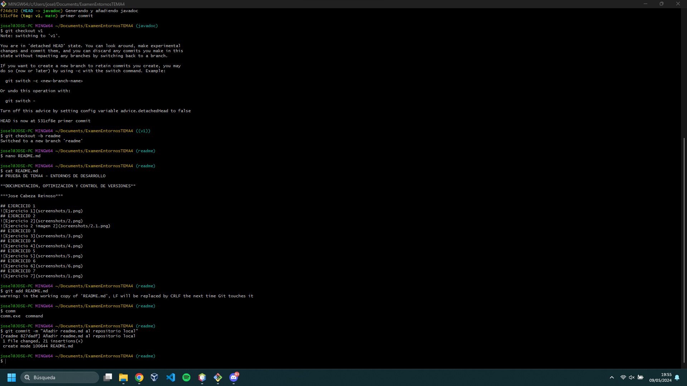
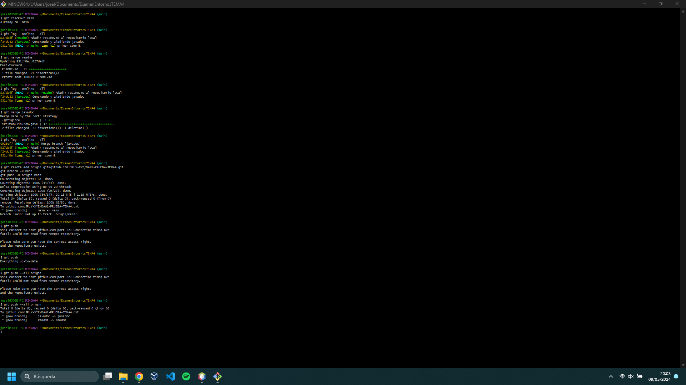
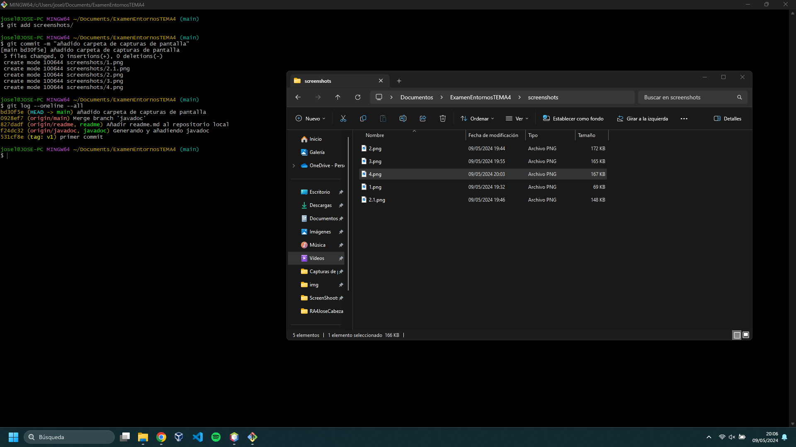
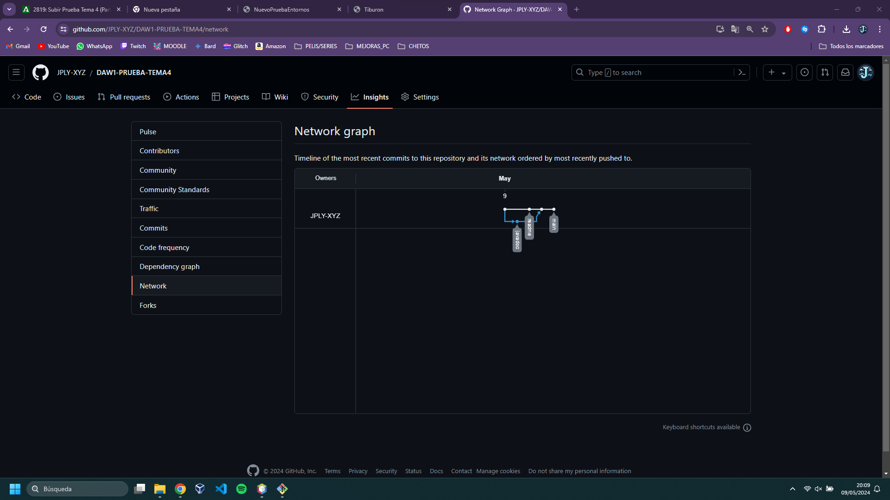

# PRUEBA DE TEMA4 - ENTORNOS DE DESARROLLO

**DOCUMENTACIÓN, OPTIMIZACIÓN Y CONTROL DE VERSIONES**

***Jose Cabeza Reinoso***

## EJERCICIO 1

## EJERCICIO 2

## EJERCICIO 3

## EJERCICIO 4

## EJERCICIO 5

## EJERCICIO 6

## EJERCICIO 7

